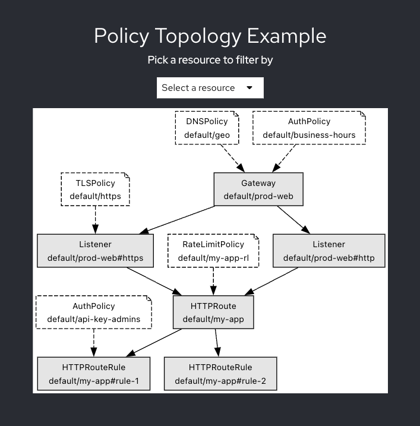

# PolicyTopology Component

[](https://www.npmjs.com/package/react-policy-topology)

`PolicyTopology` is a reusable React component for visualizing policy topologies using DOT strings.



## Getting Started

### Installation

To use the `PolicyTopology` component, you need to install the necessary dependencies.

First, make sure you have Node.js (>=20.19) installed. Then, in your project directory, run:

```bash
npm install react react-dom react-policy-topology
```

This will install `react-policy-topology` along with its peer dependencies, `react` and `react-dom`.

### Usage

To use the `PolicyTopology` component in your React application, follow these steps:

1. Import the `PolicyTopology` component:

```jsx
import React from 'react';
import PolicyTopology from 'react-policy-topology';
```

2. Use the component in your application:

```jsx
const App = () => {
  const dotString = `your DOT string here`;

  return (
    <div className="App">
      <PolicyTopology initialDotString={dotString} />
    </div>
  );
};

export default App;
```

### Props

- `initialDotString` (string): The DOT string representing the graph to visualise.

### Development

This repo uses [pnpm](https://pnpm.io/) and [Vite](https://vite.dev/). To install dependencies:

```bash
pnpm install
```

To start the development server:

```bash
pnpm start
```

This runs the example app in development mode on [http://localhost:3000](http://localhost:3000). The app renders DOT strings received over a websocket at `ws://$WEBSOCKET_HOST:$WEBSOCKET_PORT/ws` (defaults: `localhost:4000`).

### Building

To build the app for production, run:

```bash
pnpm run build
```

The build artifacts will be stored in the `build/` directory. To serve them:

```bash
pnpm run server
```

### Testing

To run the test suite (starts the dev server, a mock websocket feed, and browser tests):

```bash
pnpm run test:ci
```

### Running with Docker

```bash
docker build -t react-policy-topology .

docker run -d -p 5000:5000 \
  -e WEBSOCKET_HOST=your.websocket.host \
  -e WEBSOCKET_PORT=1234 \
  react-policy-topology
```

## Contributing

Contributions are welcome! Please open an issue or submit a pull request.

## License

This project is licensed under the Apache v2 License.
