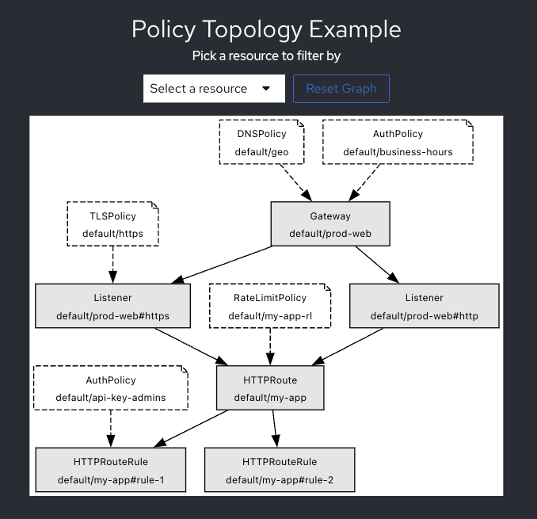

# PolicyTopology Component

`PolicyTopology` is a reusable React component for visualizing policy topologies using DOT strings.



## Getting Started

### Installation

To install the dependencies, run:

```bash
npm install
```

### Usage

To use the `PolicyTopology` component, import it into your React application and pass the required props.

TODO: Publish to npm.

```jsx
import React from 'react';
import PolicyTopology from './PolicyTopology';

const App = () => {
  const dotString = `your DOT string here`;

  return (
    <div className="App">
      <PolicyTopology dotString={dotString} />
    </div>
  );
};

export default App;
```

### Props

- `dotString` (string): The DOT string representing the graph to visualise.

### Development

To start the development server, run:

```bash
npm start
```

This runs the app in development mode. Open [http://localhost:3000](http://localhost:3000) to view it in your browser.

### Building

To build the app for production, run:

```bash
npm run build
```

The build artifacts will be stored in the `build/` directory.

### Testing

To run the test suite, run:

```bash
npm test
```

### Deployment

To deploy the app, follow the deployment instructions specific to your hosting provider.

### Example App

An example app is included in the repository to demonstrate the usage of the `PolicyTopology` component. To run the example app, navigate to the `example` directory and follow the instructions in the README file.

## Contributing

Contributions are welcome! Please open an issue or submit a pull request.

## License

This project is licensed under the Apache v2 License.